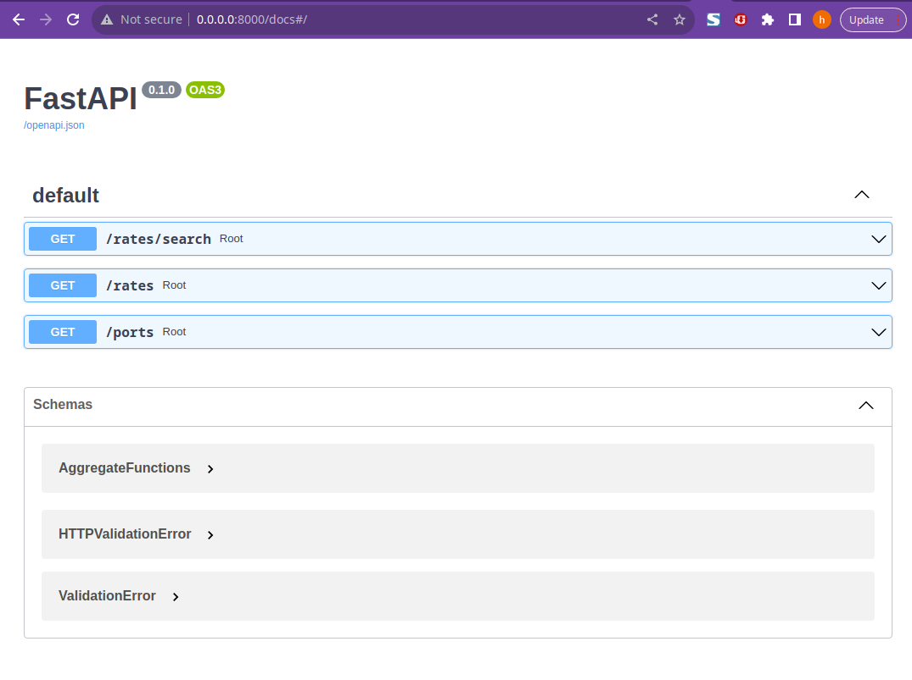

# Xeneta challenge


[](https://travis-ci.org/joemccann/dillinger)

Hi xeneta team. I present you my project I hope you like what I have done. The main tecnology used for the are the following

- [PostgreSql]
- [FastAPI]
- [Docker Compose]
- [SQLAlchemy]
- [Pytest]
- [coverage]


## Setup
To setup the whole project you have to execute the following command after cloning the respository:

```sh
$ docker compose up
```

if anything is working fine you should see a swagger UI in you browser when you go to this [link](http://0.0.0.0:8000/docs)


## Features

- You can retrieve rates by using code, name, region
- Added more aggregate function like SUM, COUNT, MIN, MAX, and STD
- A port searcher using fuzzy matching (in case you forgot the exact name of the port you want to analyze)
- A little script for converting txt file to a csv file to fill the database


## Project structure


I structured this project using resource [fastapi best practices](https://github.com/zhanymkanov/fastapi-best-practices).
The projected as followed:
```
├── app
│   ├── config.py
│   ├── database.py
│   ├── db
│   │   └── __init__.py
│   ├── db.py
│   ├── __init__.py
│   ├── main.py
│   ├── ports
│   │   ├── __init__.py
│   │   ├── router.py
│   │   ├── service.py
│   │   └── utils.py
│   ├── rates
│   │   ├── __init__.py
│   │   ├── router.py
│   │   ├── service.py
│   │   └── utils.py
│   ├── tests
│   │   ├── __init__.py
│   │   ├── test_integration.py
│   │   └── test_unit_test_rates_retrieval.py
│   └── tools
│       ├── __init__.py
│       └── utils.py
├── docker-compose.yaml
├── Dockerfile
├── images
│   ├── regions.svg
│   └── swagger.png
├── readme.md
├── requirements.txt
└── sql
    ├── create_tables.sql # this is the sql file that create the tables and fill the database with the csv when you run the docker compose
    ├── fill_tables.sql
    ├── populate_database.sql
    ├── ports.csv
    ├── ports.txt
    ├── prices.csv
    ├── prices.txt
    ├── regions.csv
    ├── regions.txt
    └── text_to_csv.py

9 directories, 34 files


9 directories, 35 files

```

Each package has its own router, schemas, models, etc.
router.py - is a core of each module with all the endpoints
service.py - module specific business logic
constants.py - module specific constants and error codes
config.py - e.g. env vars
utils.py - non-business logic functions, e.g. response normalization, data enrichment, etc.


## Test Coverage

I created several unit test and integrations test and got the following test coverage results
```
Name                                          Stmts   Miss  Cover   Missing
---------------------------------------------------------------------------
app/__init__.py                                   0      0   100%
app/config.py                                    11      0   100%
app/db/__init__.py                                0      0   100%
app/db/init_db.py                                 5      0   100%
app/main.py                                       9      1    89%   10
app/ports/__init__.py                             0      0   100%
app/ports/router.py                               9      1    89%   14
app/ports/service.py                              9      4    56%   10-17
app/ports/utils.py                               24      4    83%   56-60
app/rates/__init__.py                             0      0   100%
app/rates/router.py                              18      4    78%   17-21
app/rates/service.py                             57     11    81%   32-45, 55-60, 79, 92, 96
app/rates/utils.py                               21      0   100%
app/tests/__init__.py                             0      0   100%
app/tests/test_integration.py                    33      0   100%
app/tests/test_unit_test_rates_retrieval.py      67      2    97%   370, 412
app/tools/__init__.py                             0      0   100%
app/tools/utils.py                                9      0   100%
---------------------------------------------------------------------------
TOTAL                                           272     27    90%
```


   [SQLAlchemy]: <https://github.com/sqlalchemy>
   [coverage]: <https://coverage.readthedocs.io/en/6.5.0/>
   [Docker Compose]: <https://docs.docker.com/compose/>
   [FastAPI]: <https://fastapi.tiangolo.com/>
   [Pytest]: <https://docs.pytest.org/en/7.2.x/>
   [PostgreSql]: <https://www.postgresql.org/docs/>


